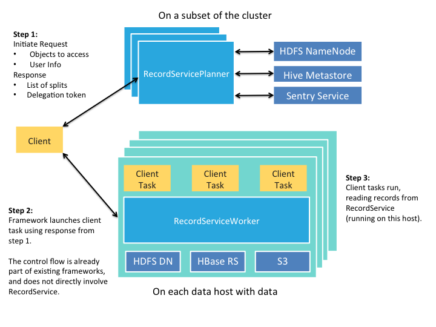

RecordService provides an abstraction layer between compute frameworks and data storage. It provides row- and column-level security, and other advantages.



## The Motivation

One of the key aspects of the Hadoop ecosystem is decoupling storage managers (for example, HDFS and Apache HBase) and compute frameworks (for example, MapReduce, Impala and Apache Spark). Although this decoupling allows for far greater flexibility &mdash; pick the framework that best solves your problem &mdash; it leads to more complexity to ensure that everything works together seamlessly. Furthermore, as Hadoop becomes an increasingly critical infrastructure component for users, the expectations for compatibility, performance, and security also increase.

RecordService is a new core security layer for Hadoop that sits between the storage managers and compute frameworks to provide a unified data access path.

{:height="100%" width="100%"}

## The Benefits

* RecordService provides fine-grained data permissions and enforcement across Hadoop.
* Clients work independently of on-disk storage format.
* The unified data access path provides a single place to implement and test file format&ndash;related changes.
* Components swap transparently above or below RecordService.
* Performance is improved through the optimized scanner, dynamic code generation, and Parquet implementation provided by Impala.
* Existing MapReduce and Spark jobs gain Impala-quality performance.
* RecordService can make projections over original source datasets instead of making copies or subsets.

## The Design

RecordService provides the following services.

* RecordServicePlanner &mdash; Generates tasks, performs authorization checks, and handles metadata access. Called during input split generation. 
* RecordServiceWorker &mdash; Executes tasks, and reads and writes to the storage layer.
    * Builds on the highly optimized I/O scheduler and file parsers provided by Impala.
    * Returns rows in a canonical format.
* Thrift APIs.
* Client Integration Libraries &mdash; Allow easy migration to RecordService.

{:height="100%" width="100%"}

